

  

<h1 align="center">OAuth2/OIDC E-Learning Platform</h1>

  

      <strong>Secure Microservices Architecture with Spring Boot 3, React 18, and Keycloak</strong>
  

   

      
      
      
      
   

  

    A full-stack implementation of an E-Learning platform demonstrating modern security practices using the OAuth 2.0 Authorization Code Flow with PKCE. The system enforces Role-Based Access Control (RBAC) to differentiate between Administrators and Students.
  

  

    <a href="#architecture">Architecture</a> &bull;
    <a href="#technologies">Technologies</a> &bull;
    <a href="#keycloak-configuration">Keycloak Setup</a> &bull;
    <a href="#installation">Installation</a> &bull;
    <a href="#application-demo">Screenshots</a>
  

<h2 id="architecture">Architecture Overview</h2>

  The application follows a decoupled architecture where authentication is delegated to an Identity Provider (Keycloak). The frontend communicates with the backend via REST APIs secured by JWT (JSON Web Tokens).

<ul>
  <li><strong>Identity Provider (IdP):</strong> Keycloak handles user authentication and issues tokens.</li>
  <li><strong>Resource Server (Backend):</strong> Spring Boot validates JWT signature and roles.</li>
  <li><strong>Client (Frontend):</strong> React (Vite) manages the user session and OIDC flow using <code>keycloak-js</code>.</li>
</ul>

<h2 id="technologies">Technologies Used</h2>

<h3>Backend</h3>
<ul>
  <li><strong>Framework:</strong> Spring Boot 3.4.0</li>
  <li><strong>Security:</strong> Spring Security 6 (OAuth2 Resource Server)</li>
  <li><strong>Database:</strong> H2 Database (Embedded)</li>
  <li><strong>Build Tool:</strong> Maven</li>
</ul>

<h3>Frontend</h3>
<ul>
  <li><strong>Framework:</strong> React 18 (Vite)</li>
  <li><strong>Styling:</strong> Tailwind CSS</li>
  <li><strong>HTTP Client:</strong> Axios (with Interceptors)</li>
  <li><strong>Auth Library:</strong> keycloak-js (Native Adapter)</li>
</ul>

<h2 id="keycloak-configuration">Keycloak Configuration Guide</h2>

  This section details the configuration steps performed on the Keycloak server to enable OIDC authentication.

<h3>1. Realm Creation</h3>

Created a dedicated realm named <code>elearning-realm</code> to isolate the application data.

  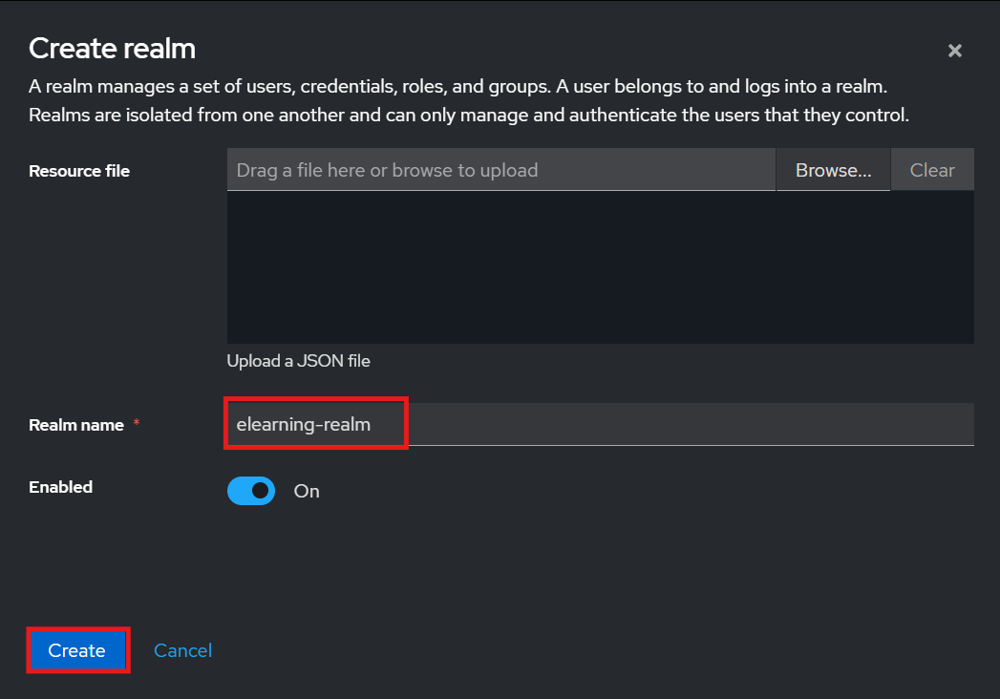

<h3>2. Client Configuration</h3>

Configured a public client <code>react-client</code> with standard OIDC flows. Valid Redirect URIs were configured to allow communication with the frontend application.

  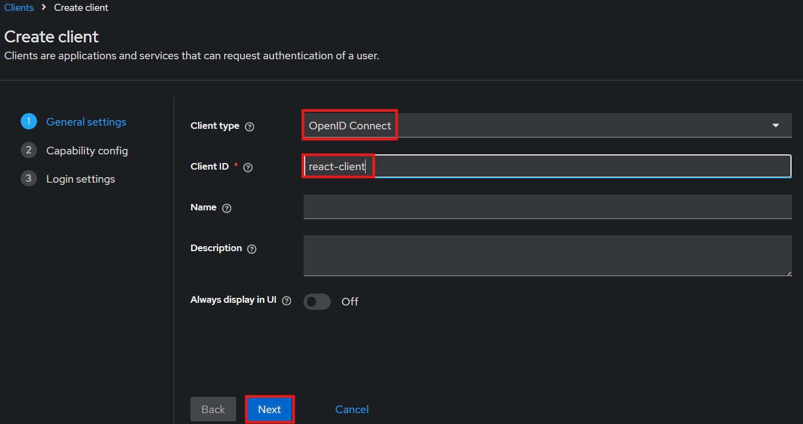
  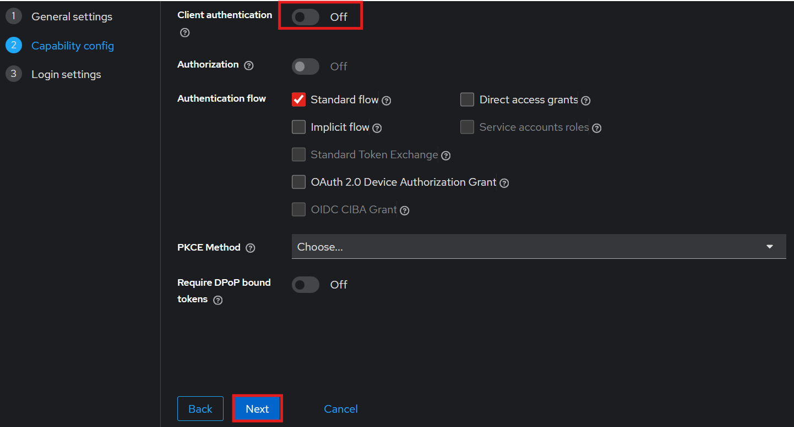
  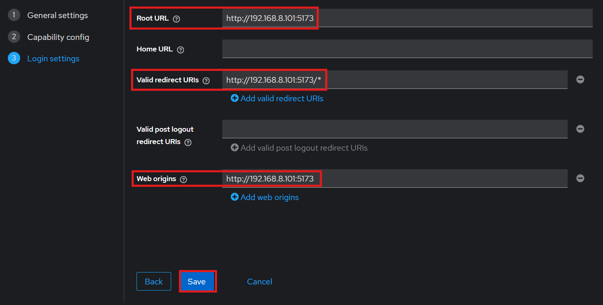

<h3>3. Role Definition</h3>

Defined two primary Realm Roles: <code>ROLE_STUDENT</code> and <code>ROLE_ADMIN</code> to manage access permissions.

  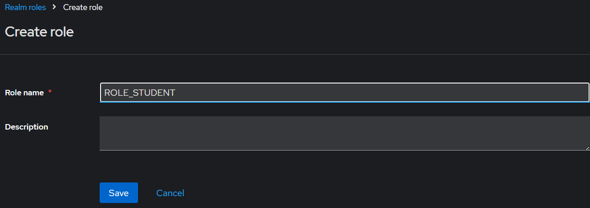
  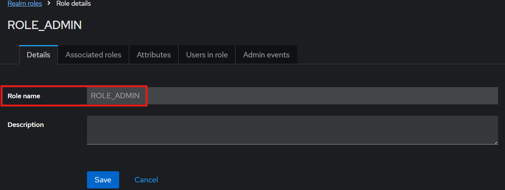

<h3>4. User Management</h3>

Created test users and assigned specific roles to simulate different authorization scenarios.

<strong>Creating Users:</strong>

  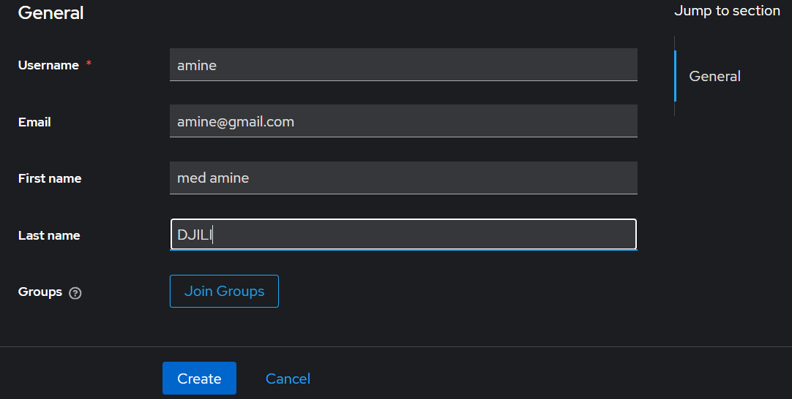

<strong>Role Assignment:</strong>

  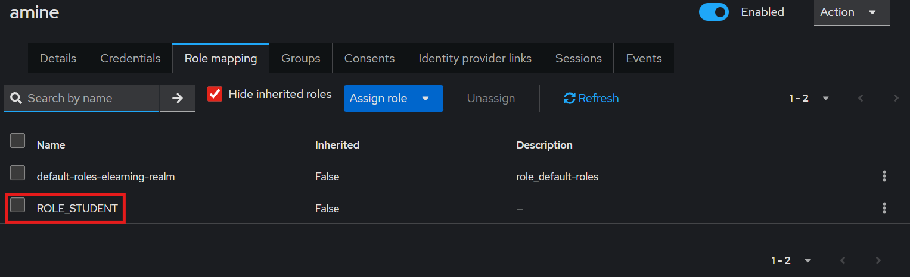

<strong>Credentials Setup:</strong>

  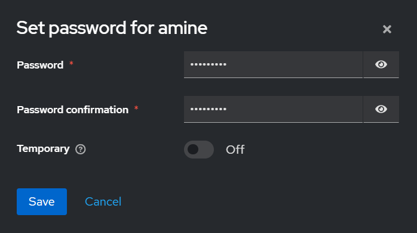

<strong>Final User List:</strong>

  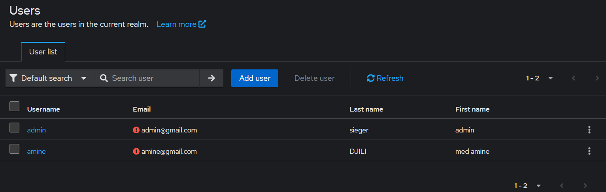

<h2 id="installation">Installation & Setup</h2>

<h3>Prerequisites</h3>
<ul>
  <li>Java Development Kit (JDK) 17 or higher</li>
  <li>Node.js (v18 or higher)</li>
  <li>Keycloak Server (Running on port 8080)</li>
</ul>

<h3>1. Backend Setup</h3>
<pre>
<code>cd backend
./mvnw clean install
./mvnw spring-boot:run</code>
</pre>

The server will start on <strong>http://localhost:8081</strong>.

<h3>2. Frontend Setup</h3>
<pre>
<code>cd frontend
npm install
npm run dev</code>
</pre>

The application will be accessible at <strong>http://localhost:5173</strong>.

<h2 id="application-demo">Application Demo</h2>

The application dynamically renders content based on the logged-in user's role.

<h3>Admin View</h3>

Users with <code>ROLE_ADMIN</code> access the dashboard with full privileges, including the ability to add new courses via the administration panel.

  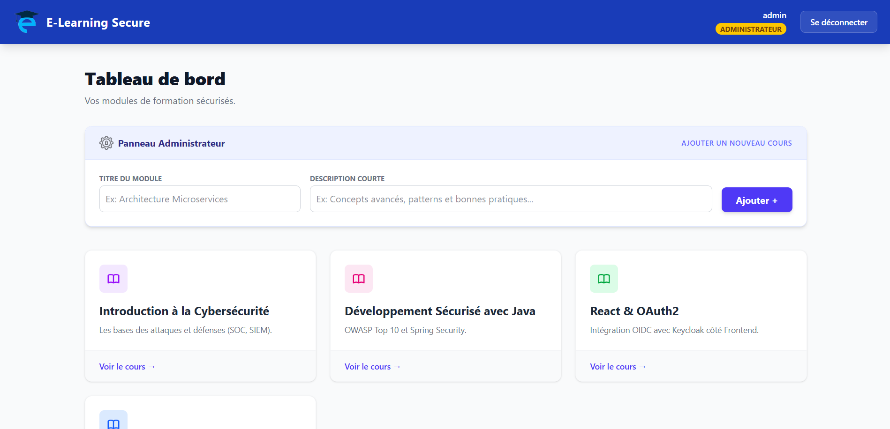

<h3>Student View</h3>

Users with <code>ROLE_STUDENT</code> have read-only access. They can view available modules but do not see administrative options.

  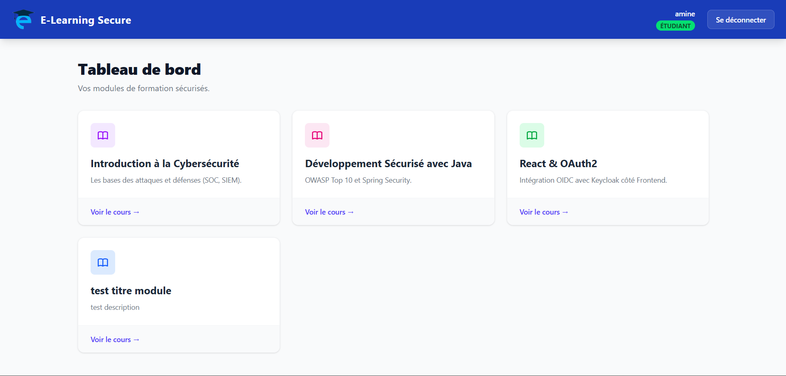

<h2 id="license">Security Implementation Details</h2>

  <strong>JWT Converter:</strong> A custom <code>KeycloakRoleConverter</code> was implemented in the Spring Boot backend to map Keycloak's <code>realm_access</code> roles to Spring Security's <code>GrantedAuthority</code> format.

  <strong>CORS Policy:</strong> Strict Cross-Origin Resource Sharing policies are applied to allow requests only from the trusted frontend origin.

  
&copy; 2025 OAuth2 E-Learning Platform Project.

